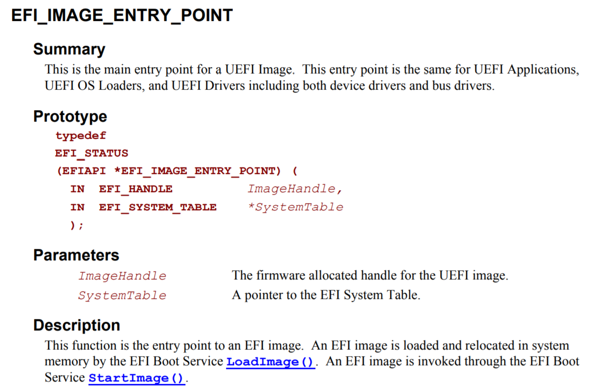
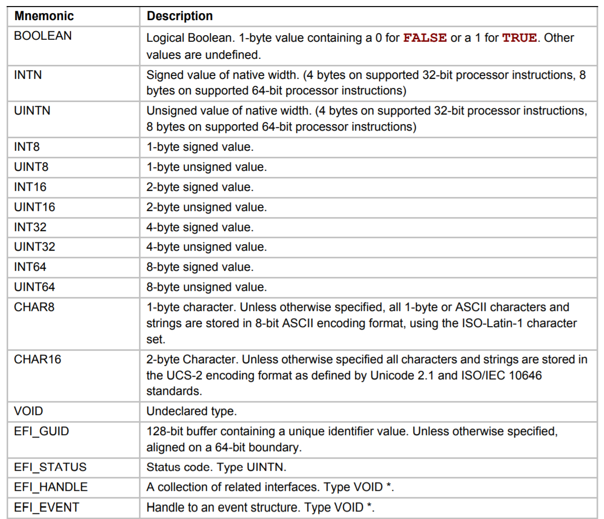
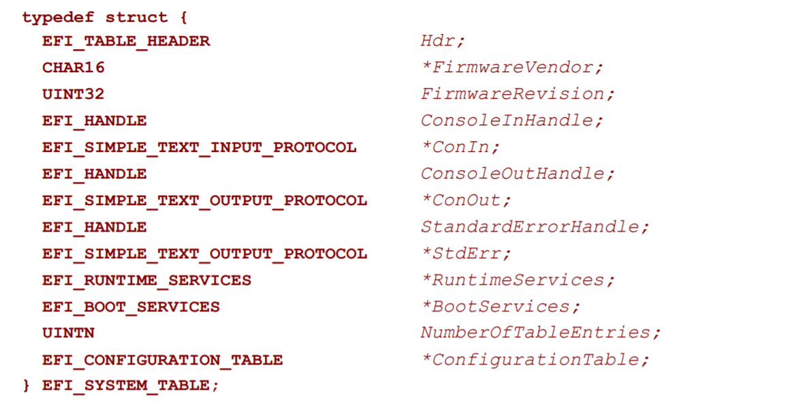
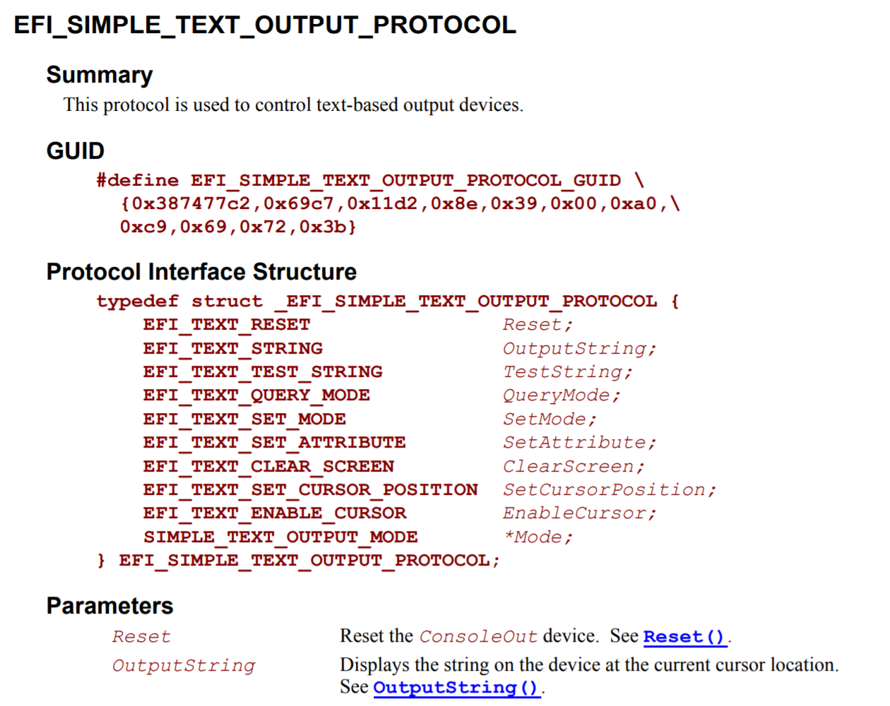
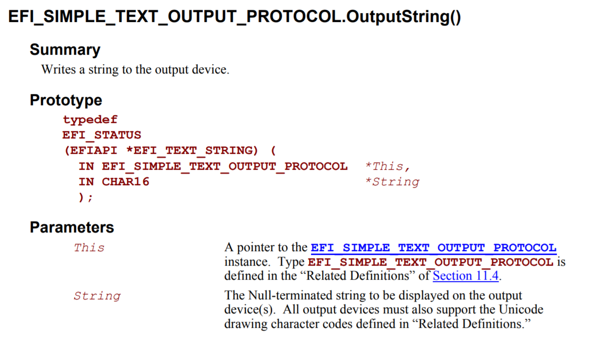

# 遵循 UEFI 标准编写程序

## 阅读 UEFI 标准文档的方法

UEFI 标准文档可以在 [https://uefi.org/specifications](https://uefi.org/specifications) 找到。本书参照的的是[2.3.1](https://uefi.org/sites/default/files/resources/UEFI_Spec_2_3_1.pdf)版本 [^1]。但是，对于本书中所涉及的范围，在不同的 UEFI 标准版本或是实现下，几乎不存在兼容性问题。

UEFI 标准文档包括 C 代码片段，并且 UEFI 固件上所运行的程序基本上都是用 C 语言编写的。例如，在 UEFI 标准文档"4.1 UEFI Image Entry Point(P.75)"中，定义了 UEFI 程序的入口点 [^2]（图 2.1）。



图 2.1：标准文档中定义的入口点

图 2.1 中展示了入口点函数的参数和返回值。由于入口点函数是通过编译期参数指定的，它可以取任何名字。参数和返回值被定义成了特殊的类型，这些类型也可以在标准文档中找到。比如在标准文档中搜索`EFI_STATUS`，我们可以找到"2.3.1 Data Types(P.23)"（图 2.2）。



图 2.2："2.3.1 Data Types" 中的 "Table 6. Common UEFI Data Types"（节选）

图 2.2 展示了标准文档中常见类型的定义。在这里，`EFI_STATUS`表示的是状态码，它的类型是`UINTN`。`UINTN`是一个与平台相关的类型，在 32 位 CPU 上，它表示 32 位无符号整数（unsigned int），而在 64 位 CPU 上，它表示 64 位无符号整数（unsigned long long）[^3]。

此外，UEFI 标准中还定义了`IN`、`OUT`、`OPTIONAL`、`EFIAPI`等修饰符（Modifier），它们是对函数或参数的说明。在像 EDK2 或是 gnu-efi 这些既有的开发环境和工具链中 [^4]，它们均被定义为空字符串。

但是在上表中，我们并不能找到"EFI_SYSTEM_TABLE"的定义。这是由于`EFI_SYSTEM_TABLE`是一个结构体的别名，它在另一个章节被定义。通过搜索标准文档，它在"4.3 EFI System Table(P.78)"中被定义，并且它也有一个 C 语言代码的定义（图 2.3）。



图 2.3：`EFI_SYSTEM_TABLE`的定义

图 2.3 展示了结构体中的成员。UEFI 标准文档中有一个叫做“协议（Protocol）”的概念。在 UEFI 中，功能被分为一个个单元，这些单元被称为“协议”，并且它们被定义成以`_PROTOCOL`结尾的结构体。名如`~_PROTOCOL`这样的结构体包含一系列的函数指针，通过这些函数指针可以调用 UEFI 固件中的内置功能。

图 2.3 中的`EFI_SIMPLE_TEXT_OUTPUT_PROTOCOL`是用来把字符输出到屏幕上的协议。那么它有哪些成员那？同样地，我们搜索标准文档，可以在"11.4 Simple Text Output Protocol(P.424)"中找到这个结构体的定义（图 2.4）。



图 2.4：`EFI_SIMPLE_TEXT_OUTPUT_PROTOCOL`的定义

查看图 2.4 中的"Protocol Interface Structure"，可以看到它有一个叫做"OutputString"的成员，这就是被用于在屏幕上显示文字的函数。图 2.4 中的"Parameters"是对各个成员的描述，并且"OutputString"拥有一个指向其定义页面的链接（下划线的"OutputString()"处）。OutputString 在标准文档中的定义如图 2.5 所示。



图 2.5：`OutputString`函数的定义

它的参数的含义如下：

* `IN EFI_SIMPLE_TEXT_OUTPUT_PROTOCOL *This`: 指向`EFI_SIMPLE_TEXT_OUTPUT_PROTOCOL`自身的指针
* `IN CHAR16 *String`: 指向输出的字符串的指针，UEFI 的字符是 Unicode 编码的（2 字节/UCS-2）

返回值类型为`EFI_STATUS`(在 AMD64 平台上是 uint64_t)。这个值表示函数的执行结果。函数如果执行成功，那么返回 0，如果产生错误或警告返回非 0 值。本书中只检查“函数是否返回 0”（即函数是否成功执行），对于其他的函数返回值，请参考标准文档"Appendix D Status Codes(P.1873)"中对各个协议返回值的描述。

由于 UEFI 所有协议中函数的第一个参数均为指向协议自身的指针，并且返回值类型均为`EFI_STATUS`类型。在接下来的章节中这点将作为约定，不再进行说明。

此外，由于部分 UEFI 固件启动时会在屏幕上显示内容（比如厂商的 logo），在这里，我们先进行一次清屏操作，再调用`OutputString`在屏幕上打印字符串。

用于清屏的函数是`EFI_SIMPLE_TEXT_OUTPUT_PROTOCOL`中的`ClearScreen`函数（标准文档"11.4 Simple Text Output Protocol(P.437)"）。虽然不在图 2.4 中，但它的描述仍然在"Parameters"中。`ClearScreen`的定义如图 2.6 所示，它的参数只有一个指向协议自身的`This`指针。


图 2.6: `ClearScreen`的定义

在接下来的章节中，将会在示例代码中说明函数参数的定义。


## 编写 UEFI 应用程序

了解了入口点的标准和如何调用函数来向屏幕中打印字符串之后，是时候编写一个 hello world 程序了。这一章的示例代码在目录`hello`中 (日文版为`sample1_1_hello_uefi`)。

在本书中使用的开发环境为 Debian GNU/Linux，这是作者的工作环境。但是，你可以在几乎任何支持交叉编译和格式化U盘（具体将在之后叙述）的环境下开发。当然，任何文本编辑器都可以。

在屏幕上打印"Hello UEFI!"的源代码如代码 2.1 所示。

```c
struct EFI_SYSTEM_TABLE {
    char _buf[60];
    struct EFI_SIMPLE_TEXT_OUTPUT_PROTOCOL {
        unsigned long long _buf;
        unsigned long long (*OutputString)(
            struct EFI_SIMPLE_TEXT_OUTPUT_PROTOCOL *This,
            unsigned short *String);
        unsigned long long _buf2[4];
        unsigned long long (*ClearScreen)(
             struct EFI_SIMPLE_TEXT_OUTPUT_PROTOCOL *This);
    } *ConOut;
};
  
void efi_main(void *ImageHandle __attribute__ ((unused)),
    struct EFI_SYSTEM_TABLE *SystemTable)
{
    SystemTable->ConOut->ClearScreen(SystemTable->ConOut);
    SystemTable->ConOut->OutputString(SystemTable->ConOut, L"Hello UEFI!\n");
    while (1);
}

```

代码 2.1： `ubmp-cn-code/baremetal/hello/main.c`

代码 2.1 中的`EFI_SYSTEM_TABLE`仅定义了要使用的函数。我们用一个变量或是数组来占用未使用的函数的位置，来使得要使用的函数的地址正确。

`efi_main`是我们定义的入口点的函数名。在调用`OutputString`函数之前，我们先调用`ClearScreen`函数来清屏。函数末尾是一个无限循环，也就是说，这个函数永远不会返回。

此处，所有像`EFI_STATUS`这样的 UEFI 类型都被写为`unsigned long long`。这仅仅是作者个人的偏好。这么做会降低程序的可移植性，对于 UEFI 类型的最佳做法是用 typedef 来定义它们。

在接下来的内容中，我们假设把代码 1.1 的内容保存在文件`main.c`中。

> 注：字符串前的`L`的作用
> `L` 告示编译器使用两个字节的 unicode 字符集。宽字符占位可根据编译设置，和文本编码关联 2 字节或 4 字节。如  L"我的字符串"，表示将 ANSI 字符串转换成 unicode 的字符串，就是每个字符占用两个字节。
> 
> ```C
> strlen("asd")   =   3;   
> strlen(L"asd")   =   6;
> ```
> 补充：`_T` 宏可以把一个引号引起来的字符串，根据你的环境设置，使得编译器会根据编译目标环境选择合适的（Unicode 还是 ANSI）字符处理方式。如果你定义了 UNICODE，那么`_T` 宏会把字符串前面加一个 `L`。这时 `_T("ABCD")` 相当于 `L"ABCD"` ，这是宽字符串。如果没有定义，那么`_T`宏不会在字符串前面加那个 `L`，`_T("ABCD")`就等价于 `"ABCD"`。


[^1]: 由于作者用于测试的实机环境为 Lenovo ThinkPad E450，其 UEFI 固件遵循 2.3.1 版标准

[^2]: 一般的 C 语言程序的入口点为 main 函数

[^3]: 译者注：此处更精确的描述应为 32 位为`uint32_t`, 64 位为`uint64_t`

[^4]: 本书由于采用裸机编程，上述两者并不会被使用，但它们的源代码会作为调用 UEFI 功能的参考
