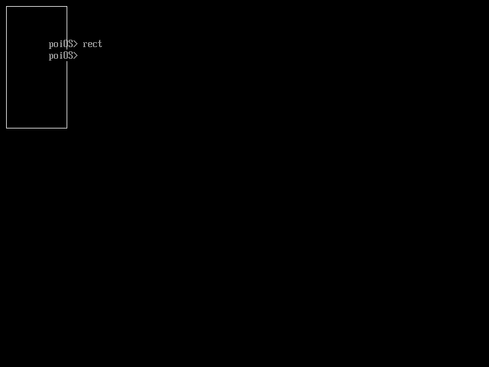

# 在屏幕上画一个矩形

了解了帧缓冲区起始地址和像素格式之后，可以看出，要在屏幕上绘制图形，所要做的就是写入帧缓冲区对应的像素信息。本节将以画一个矩形为例子来介绍这个过程，示例代码的目录为`draw-rect` (日文版为`sample3_1_draw_rect`)。

首先，我们新建一个存放图形处理相关的代码的源文件`graphics.c`，并在其中创建一个函数`draw_pixel`，这个函数用于在屏幕上指定位置绘制一个像素（代码4.6）。

```c
void draw_pixel(unsigned int x, unsigned int y,
        struct EFI_GRAPHICS_OUTPUT_BLT_PIXEL color)
{
    unsigned int hr = GOP->Mode->Info->HorizontalResolution;
    struct EFI_GRAPHICS_OUTPUT_BLT_PIXEL *base =
        (struct EFI_GRAPHICS_OUTPUT_BLT_PIXEL *)GOP->Mode->FrameBufferBase;
    struct EFI_GRAPHICS_OUTPUT_BLT_PIXEL *p = base + (hr * y) + x;

    p->Blue = color.Blue;
    p->Green = color.Green;
    p->Red = color.Red;
    p->Reserved = color.Reserved;
}
```

代码4.6: `draw-rect/graphics.c:draw_pixel`

在代码4.6中，主要做了这三件小事：

1. 通过`GOP->Mode->Info->HorizontalResolution`获取水平分辨率
2. 根据水平分辨率，和给定的横纵坐标，计算所要绘制的像素在帧缓冲区中的偏移量
3. 向该像素写入给定的颜色值

此处获取到的水平分辨率是UEFI固件默认识别的水平分辨率，并不一定是显示器的物理分辨率。在作者的ThinkPad E450上，这个值是640像素。屏幕的显示模式可以通过`EFI_GRAPHICS_OUTPUT_PROTOCOL`的`SetMode`函数（标准文档"11.9 Graphics Output Protocol(P.473)"）来改变，有兴趣的读者可以自行尝试。`SetMode`函数的参数是显示模式的ID，所支持的显示模式的最大值可以通过`GOP->Mode->MaxMode`获取。[^1]

接下来，通过调用`draw_pixel`函数，我们可以方便地实现绘制矩形的函数`draw_rect`（代码4.7）。

```c
void draw_rect(struct RECT r, struct EFI_GRAPHICS_OUTPUT_BLT_PIXEL c)
{
    unsigned int i;

    for (i = r.x; i < (r.x + r.w); i++)
        draw_pixel(i, r.y, c);
    for (i = r.x; i < (r.x + r.w); i++)
        draw_pixel(i, r.y + r.h - 1, c);

    for (i = r.y; i < (r.y + r.h); i++)
        draw_pixel(r.x, i, c);
    for (i = r.y; i < (r.y + r.h); i++)
        draw_pixel(r.x + r.w - 1, i, c);
}
```

代码4.7: `draw-rect/graphics.c:draw_rect`[^2]

存储矩形信息的`RECT`结构体如代码4.8所示，我们把它的定义放在`graphics.h`中。

```c
struct RECT {
    unsigned int x, y;
    unsigned int w, h;
};
```

代码4.8: 结构体`RECT`的定义

使用上面这些函数，我们可以向Shell中添加一个绘制矩形的命令`rect`。添加后的`shell.c`如代码4.9所示。

```c
#include "common.h"
#include "graphics.h"
#include "shell.h"

#define MAX_COMMAND_LEN  100

void shell(void)
{
    unsigned short com[MAX_COMMAND_LEN];
    struct RECT r = {10, 10, 100, 200};  /* 新增 */

    while (TRUE) {
        puts(L"poiOS> ");
        if (gets(com, MAX_COMMAND_LEN) <= 0)
            continue;

        if (!strcmp(L"hello", com))
            puts(L"Hello UEFI!\r\n");
        else if (!strcmp(L"rect", com))  /* 新增 */
            draw_rect(r, white);         /* 新增 */
        else
            puts(L"Command not found.\r\n");
    }
}
```

代码4.9: `draw-rect/shell.c`

图4.2展示了这个程序的运行情况。



图4.2: 执行`rect`命令的截图


[^1]: 译者注：获取所有支持的显示模式可以使用`GOP->QueryMode`函数（标准文档"11.9 Graphics Output Protocol(P.471)"），`SetMode`和`QueryMode`这两个函数会在第二部分[2.4 设置文本显示模式](../../part2/output/setmode.md)提到。

[^2]: 译者注：传递结构体作为参数开销较大，这里更好的做法是传递结构体指针
