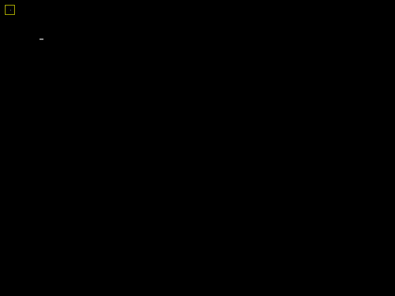

# 实现鼠标指针

现在，我们已经知道了如何在屏幕上绘制图形和如何获取鼠标的输入值，接下来我们将向那个只有一个矩形图标的"GUI"加入一个鼠标指针。本节示例代码的目录为`cursor` (日文版为`sample4_2_add_cursor`)。

为了简化实现，这里我们的鼠标指针只有1像素。加入了鼠标指针的`gui.c`如代码5.5所示。

```c
#include "efi.h"
#include "common.h"
#include "graphics.h"
#include "shell.h"
#include "gui.h"

/* 新增(此处开始) */
struct EFI_GRAPHICS_OUTPUT_BLT_PIXEL cursor_tmp = {0, 0, 0, 0};
int cursor_old_x;
int cursor_old_y;

void draw_cursor(int x, int y)
{
    draw_pixel(x, y, white);
}

void save_cursor_area(int x, int y)
{
    cursor_tmp = get_pixel(x, y);
    cursor_tmp.Reserved = 0xff;
}

void load_cursor_area(int x, int y)
{
    draw_pixel(x, y, cursor_tmp);
}

void put_cursor(int x, int y)
{
    if (cursor_tmp.Reserved)
        load_cursor_area(cursor_old_x, cursor_old_y);

    save_cursor_area(x, y);

    draw_cursor(x, y);

    cursor_old_x = x;
    cursor_old_y = y;
}
/* 新增(此处结束) */

void gui(void)
{
    struct RECT r = {10, 10, 20, 20};
    /* 新增/修改(此处开始) */
    unsigned long long status;
    struct EFI_SIMPLE_POINTER_STATE s;
    int px = 0, py = 0;
    unsigned long long waitidx;
    unsigned char is_highlight = FALSE;

    ST->ConOut->ClearScreen(ST->ConOut);
    SPP->Reset(SPP, FALSE);

    /* 绘制一个矩形图标 */
    draw_rect(r, white);

    while (TRUE) {
        ST->BootServices->WaitForEvent(1, &(SPP->WaitForInput), &waitidx);
        status = SPP->GetState(SPP, &s);
        if (!status) {
            /* 更新鼠标指针位置 */
            px += s.RelativeMovementX >> 13;
            if (px < 0)
                px = 0;
            else if (GOP->Mode->Info->HorizontalResolution <=
                 (unsigned int)px)
                px = GOP->Mode->Info->HorizontalResolution - 1;
            py += s.RelativeMovementY >> 13;
            if (py < 0)
                py = 0;
            else if (GOP->Mode->Info->VerticalResolution <=
                 (unsigned int)py)
                py = GOP->Mode->Info->VerticalResolution - 1;

            /* 绘制鼠标指针 */
            put_cursor(px, py);

            /* 鼠标悬浮于矩形图标上时，高亮矩形图标 */
            if (is_in_rect(px, py, r)) {
                if (!is_highlight) {
                    draw_rect(r, yellow);
                    is_highlight = TRUE;
                }
            } else {
                if (is_highlight) {
                    draw_rect(r, white);
                    is_highlight = FALSE;
                }
            }
        }
    }
    /* 新增/修改(此处结束) */
}
```

代码5.5: `cursor/gui.c`

修改后的`gui`函数在先前的清屏和绘制矩形之后，进入一个循环，并在循环中执行下面的操作：

1. 调用`WaitForEvent`函数等待鼠标输入，并用`GetState`函数获取鼠标的输入值
2. 更新屏幕上光标的位置
3. 绘制光标（`put_cursor`函数）
4. 更新矩形图标（悬浮于其上时高亮）

`put_cursor`函数是一个将鼠标指针移动至指定位置的函数，它执行的操作如下：

1. 恢复之前保存的旧的光标位置的像素数据（`load_cursor_area`）
2. 保存新的光标位置的像素数据（`save_cursor_area`）
3. 在新的光标位置绘制像素（`draw_cursor`）
4. 保存当前光标位置（`cursor_old_x`和`cursor_old_y`)

`save_cursor_data`函数中使用了我们在`graphics.c`中新增加的`get_pixel`函数来从帧缓冲区中读取像素数据，得到的是一个`EFI_GRAPHICS_OUTPUT_BLT_PIXEL`类型的结构体。对于其中的成员`Reserved`，所得到的值是0，但是当写入时，`Reserved`值为0会导致没有任何内容被显示，因此我们在`save_cursor_data`中需要把保存的像素的`Reserved`值设为`0xff`。在`put_cursor`函数中，我们藉由这点来判定是否存在保存的像素。

回到`gui`函数的那个循环，对于第2步更新屏幕上光标的位置，是以上一节`pstat`所得到的数据为依据粗略计算得到的。由于所得到的移动量低12位均为0，而右移12位时的移动量太大了，因此这里我们右移13位。如果你的鼠标移动量过大或过小，请通过`pstat`得到的数据进行相应的调节。[^1]

在第4步更新矩形图标时，如果当前光标位于矩形图标范围内，则将矩形图标的颜色设置为高亮色（此处为黄色），否则，矩形将被设为初始颜色，这一设置过程通过简单的覆盖来实现。

在Shell中通过`gui`命令来进入修改后的GUI模式，将显示图5.2这样的画面。图片中矩形右侧的点为光标。当鼠标悬浮于矩形之上时，矩形将会变为黄色（图5.3）。[^2]


图5.2: 带光标的GUI (矩形图标右侧1像素的小白点为光标)



图5.3: 光标悬浮于矩形图标上时的高亮显示


[^1]: 译者注：根据标准文档"11.5 Simple Pointer Protocol(P.439)"所述，鼠标移动的实际距离是通过`RelativeMovementX / ResolutionX`计算出的，单位为毫米，而`ResolutionX`是`SPP->Mode`（书中定义忽略）的成员。关于这方面更详细的内容，请阅读标准文档。

[^2]: 译者注：这里由于译者更新了图片，删去了原作者的两条关于图片的注释
