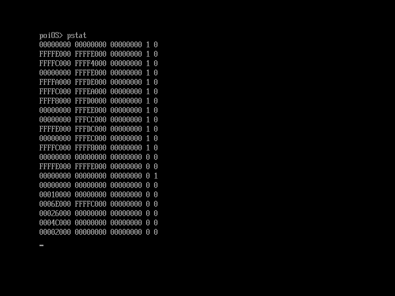

# 查看鼠标状态(pstat命令)

了解了如何通过`EFI_SIMPLE_POINTER_PROTOCOL`获取鼠标状态之后，接下来我们来尝试实现一个在终端上打印鼠标状态的功能。这里我们把这个功能作为Shell中的`pstat`命令来实现。本节示例代码的目录为`pstat` (日文版为`sample4_1_get_pointer_state`)。

首先，和上一章的图形输出协议一样，我们需要调用`LocateProtocol`函数来获取它的入口地址。因此，我们也要向`efi.c`的`efi_init`函数中加入处理`EFI_SIMPLE_POINTER_PROTOCOL`的代码，并将其设置为一个全局变量，如代码5.3所示。

```c
#include "efi.h"
#include "common.h"

struct EFI_SYSTEM_TABLE *ST;
struct EFI_GRAPHICS_OUTPUT_PROTOCOL *GOP;
struct EFI_SIMPLE_POINTER_PROTOCOL *SPP;  /* 新增 */

void efi_init(struct EFI_SYSTEM_TABLE *SystemTable)
{
    struct EFI_GUID gop_guid = {0x9042a9de, 0x23dc, 0x4a38, \
                    {0x96, 0xfb, 0x7a, 0xde, \
                     0xd0, 0x80, 0x51, 0x6a}};
    /* 新增(此处开始) */
    struct EFI_GUID spp_guid = {0x31878c87, 0xb75, 0x11d5, \
                    {0x9a, 0x4f, 0x0, 0x90,    \
                     0x27, 0x3f, 0xc1, 0x4d}};
    /* 新增(此处结束) */

    ST = SystemTable;
    ST->BootServices->SetWatchdogTimer(0, 0, 0, NULL);
    ST->BootServices->LocateProtocol(&gop_guid, NULL, (void **)&GOP);
    /* 新增 */
    ST->BootServices->LocateProtocol(&spp_guid, NULL, (void **)&SPP);
}
```

代码5.3: `pstat/efi.c`

向Shell中新增`pstat`命令的代码如代码5.4所示。

```c
#include "efi.h"    /* 新增 */
#include "common.h"
#include "graphics.h"
#include "shell.h"
#include "gui.h"

#define MAX_COMMAND_LEN  100

/* 新增(此处开始) */
void pstat(void)
{
    unsigned long long status;
    struct EFI_SIMPLE_POINTER_STATE s;
    unsigned long long waitidx;

    SPP->Reset(SPP, FALSE);

    while (1) {
        ST->BootServices->WaitForEvent(1, &(SPP->WaitForInput),
                           &waitidx);
        status = SPP->GetState(SPP, &s);
        if (!status) {
            puth(s.RelativeMovementX, 8);
            puts(L" ");
            puth(s.RelativeMovementY, 8);
            puts(L" ");
            puth(s.RelativeMovementZ, 8);
            puts(L" ");
            puth(s.LeftButton, 1);
            puts(L" ");
            puth(s.RightButton, 1);
            puts(L"\r\n");
        }
    }
}
/* 新增(此处结束) */

void shell(void)
{
    unsigned short com[MAX_COMMAND_LEN];
    struct RECT r = {10, 10, 100, 200};

    while (TRUE) {
        puts(L"poiOS> ");
        if (gets(com, MAX_COMMAND_LEN) <= 0)
            continue;

        if (!strcmp(L"hello", com))
            puts(L"Hello UEFI!\r\n");
        /* ...省略... */
        else if (!strcmp(L"pstat", com))  /* 新增 */
            pstat();                      /* 新增 */
        else
            puts(L"Command not found.\r\n");
    }
}
```

代码5.4: `pstat/shell.c`

代码5.4中，`pstat`函数调用`puth`函数来在屏幕上显示数字。在这个例子中，我们在`common.c`添加了`puth`这个辅助函数来输出某个数字的16进制值，它的第一个参数为要输出的数字，第二个参数是数字的长度（字节为单位）。

代码5.4的运行时截图如图5.1所示。



图5.1: 执行pstat命令的截图
