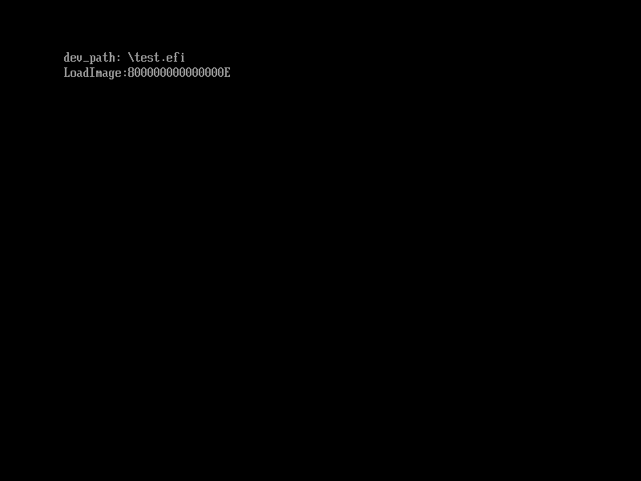

# 从设备路径加载镜像

创建完设备路径之后，就可以用`LoadImage()`函数加载镜像了，这个函数是`EFI_BOOT_SERVICES`的成员，图4.14展示了它的定义。

本节示例代码的目录为`load-path` (日文版为`032_load_devpath_1`)。

```c
struct EFI_SYSTEM_TABLE {
    ...
    struct EFI_BOOT_SERVICES {
        ...
        // Image Services
        unsigned long long (*LoadImage)(
            unsigned char BootPolicy,
                /* 镜像是否由Boot manager加载，这里我们用FALSE */
            void *ParentImageHandle,
                /* 调用者的镜像句柄，这里是efi_main的第一个参数ImageHandle */
            struct EFI_DEVICE_PATH_PROTOCOL *DevicePath,
                /* 要载入镜像的设备路径 */
            void *SourceBuffer,
                /* 如果不为NULL，则在该指针指向的位置拷贝一份要载入的镜像 */
            unsigned long long SourceSize,
                /* SourceBuffer的大小，如果不使用则为0 */
            void **ImageHandle
                /* 得到的被载入的镜像句柄 */
            );
        ...
    } *BootServices;
};
```

图4.14: `LoadImage()`的定义（位于`efi.h`中）

利用这个函数来加载上一节中的`\test.efi`的代码如图4.15所示

```c
#include "efi.h"
#include "common.h"

void efi_main(void *ImageHandle __attribute__ ((unused)),
          struct EFI_SYSTEM_TABLE *SystemTable)
{
    struct EFI_DEVICE_PATH_PROTOCOL *dev_path;  /* 新增 */
    unsigned long long status;                  /* 新增 */
    void *image;

    efi_init(SystemTable);
    ST->ConOut->ClearScreen(ST->ConOut);

    dev_path = DPFTP->ConvertTextToDevicePath(L"\\test.efi");
    puts(L"dev_path: ");
    puts(DPTTP->ConvertDevicePathToText(dev_path, FALSE, FALSE));
    puts(L"\r\n");

    /* 新增(此处开始) */
    status = ST->BootServices->LoadImage(FALSE, ImageHandle, dev_path, NULL,
                         0, &image);
    assert(status, L"LoadImage");
    puts(L"LoadImage: Success!\r\n");
    /* 新增(此处结束) */

    while (TRUE);
}
```

图4.15: 使用`LoadImage()`的例子

这段代码沿用上一节中的代码来创建设备路径，再以生成的设备路径为参数调用`LoadImage()`函数来加载`\test.efi`。如果加载失败，我们调用`assert()`函数输出一条错误信息，并中止程序运行；如果加载成功，则会调用`puts()`在屏幕上显示"LoadImage: Success!"。

要运行这个程序，我们还需要被加载的UEFI应用程序`\test.efi`，这里我们使用[第一部分第1章](../../part1/basics)编写的“Hello UEFI!”程序。但是要注意，我们需要修改编译选项使得它可以被载入，具体将在下面说明。编译完成后，把生成的`.efi`文件重命名为`test.efi`并放在文件系统根目录就可以了[^1]。

图4.15展示了程序的运行结果，这里的错误代码`0x80000000 0000000E`表示`EFI_NOT_FOUND`[^2]，这说明程序无法载入`\test.efi`的原因是它找不到这个文件。



图4.16: 图4.15程序输出的错误

产生这个错误的原因是我们之前创建的设备路径并不完整，因而`LoadImage()`无法找到`test.efi`。事实上，我们需要在`dev_path`加入一些内容才能使之成为完整的设备路径。接下来的小节将解释这个问题。


> **编译可被加载的UEFI应用程序**
> 
> 通过`LoadImage()`加载的UEFI应用程序，它的可执行文件必须是一个可重定位目标文件(shared object)[^3]。因此，需要在编译器`x86_64-w64-mingw32-gcc`的编译选项中加入`-shared`，而我们可以像图4.16这样修改Makefile来实现这点。
> 
> ```diff
> all: fs/EFI/BOOT/BOOTX64.EFI
> 
> fs/EFI/BOOT/BOOTX64.EFI: main.c
>     mkdir -p fs/EFI/BOOT
>     x86_64-w64-mingw32-gcc -Wall -Wextra -e efi_main -nostdinc \
> + -nostdlib -fno-builtin -Wl,--subsystem,10 -shared -o $@ $<
> - -nostdlib -fno-builtin -Wl,--subsystem,10 -o $@ $<
> ```
> 
> 图4.17: 在Makefile中指定编译为可重定位目标文件


[^1]: 译者注：中文版的Makefile会自动完成这一操作。

[^2]：详见标准文档"Appendix D Status Codes(P.1873)"

[^3]: 译者注：如果想要了解为什么要这么做，可以看[https://descent-incoming.blogspot.com/2017/12/uefi-program-by-gcc.html](https://descent-incoming.blogspot.com/2017/12/uefi-program-by-gcc.html)
