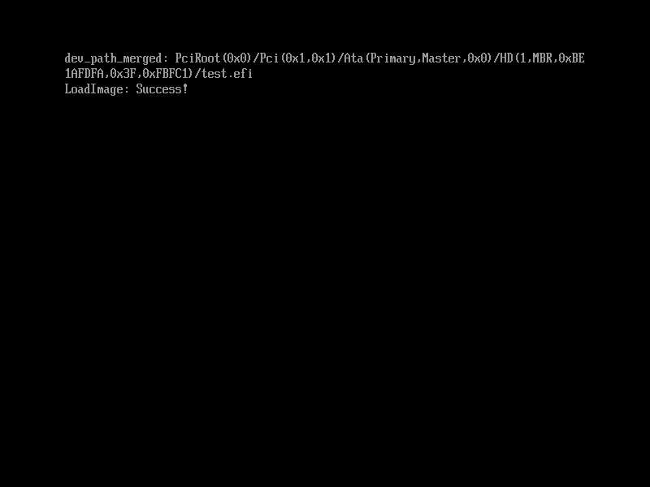

# 从完整的设备路径加载镜像

接下来，让我们再一次尝试从设备路径加载镜像。

本节示例代码的目录为`load-devpath` (日文版为`035_load_devpath_2`)。

这次我们要从上一节中处理好的完整设备路径来加载。所要做的，就是把上一节图4.24的代码和[4.3 从设备路径加载镜像](./loaddevpath.md)中图4.15中调用`LoadImage`的代码组合起来，就像图4.27这样。

```c
#include "efi.h"
#include "common.h"

void efi_main(void *ImageHandle, struct EFI_SYSTEM_TABLE *SystemTable)
{
    struct EFI_LOADED_IMAGE_PROTOCOL *lip;
    struct EFI_DEVICE_PATH_PROTOCOL *dev_path;
    struct EFI_DEVICE_PATH_PROTOCOL *dev_node;
    struct EFI_DEVICE_PATH_PROTOCOL *dev_path_merged;
    unsigned long long status;
    void *image;  /* 新增 */

    efi_init(SystemTable);
    ST->ConOut->ClearScreen(ST->ConOut);

    /* 获取ImageHandle的EFI_LOADED_IMAGE_PROTOCOL(lip) */
    status = ST->BootServices->OpenProtocol(
        ImageHandle, &lip_guid, (void **)&lip, ImageHandle, NULL,
        EFI_OPEN_PROTOCOL_GET_PROTOCOL);
    assert(status, L"OpenProtocol(lip)");

    /* 获取lip->DeviceHandle的EFI_DEVICE_PATH_PROTOCOL(dev_path) */
    status = ST->BootServices->OpenProtocol(
        lip->DeviceHandle, &dpp_guid, (void **)&dev_path, ImageHandle,
        NULL, EFI_OPEN_PROTOCOL_GET_PROTOCOL);
    assert(status, L"OpenProtocol(dpp)");

    /* 创建test.efi的设备节点 */
    dev_node = DPFTP->ConvertTextToDeviceNode(L"test.efi");

    /* 把dev_node附加到dev_path后 */
    dev_path_merged = DPUP->AppendDeviceNode(dev_path, dev_node);

    /* 把dev_path_merged转换成字符串并显示 */
    puts(L"dev_path_merged: ");
    puts(DPTTP->ConvertDevicePathToText(dev_path_merged, FALSE, FALSE));
    puts(L"\r\n");

    /* 新增(此处开始) */
    /* 从dev_path_merged加载镜像 */
    status = ST->BootServices->LoadImage(FALSE, ImageHandle,
                         dev_path_merged, NULL, 0, &image);
    assert(status, L"LoadImage");
    puts(L"LoadImage: Success!\r\n");
    /* 新增(此处结束) */

    while (TRUE);
}
```

图4.27: 从完整的设备路径加载镜像的例子

运行这个程序，可以看到，这次我们终于成功地加载了`test.efi`（图4.28）。



图4.28: 成功加载`test.efi`
